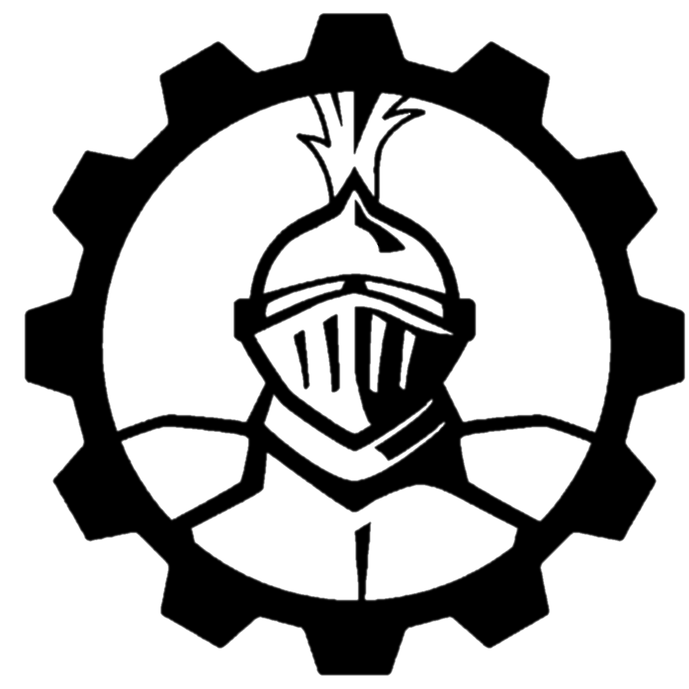

	
	<h1>2020-Robot</h1>
	

		<b>🤖 Source code for the 2020 robot playing Infinite Recharge</b>
	

    
     
    
    
     
	 
	 
	 

# 2020-robot

Core application for Team 501 The PowerKnights' robot.

# Contributing

See `CONTRIBUTING.md` for more information

# License

This project is licensed under the BSD-2 license.
 
&copy; 2020 Team 501 - The PowerKnights. Please see `LICENSE` for full license details.
